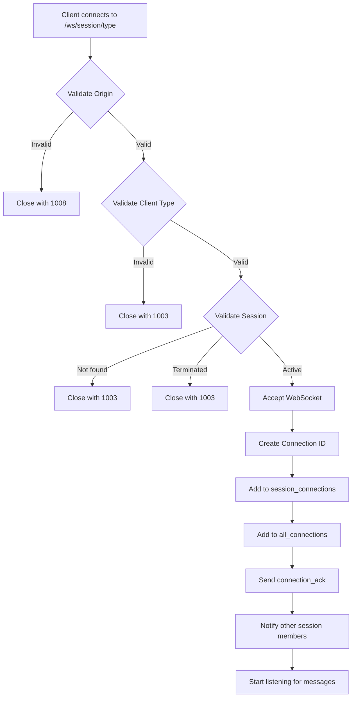

# WebSocket Architecture Documentation

## Overview

This document describes the WebSocket architecture for real-time bidirectional message delivery in the Smart Speech Flow system. It covers the singleton pattern implementation, message broadcasting, connection management, and troubleshooting guidelines.

**Last Updated**: 2025-11-05
**Status**: Living Document (Updated with refactoring)

---

## Table of Contents

1. [Architecture Principles](#architecture-principles)
2. [Component Overview](#component-overview)
3. [Singleton Pattern](#singleton-pattern)
4. [Connection Lifecycle](#connection-lifecycle)
5. [Message Broadcasting](#message-broadcasting)
6. [Dependency Injection](#dependency-injection)
7. [Error Handling](#error-handling)
8. [Monitoring & Metrics](#monitoring--metrics)
9. [Troubleshooting](#troubleshooting)

---

## Architecture Principles

### Design Goals

1. **Single Source of Truth**: Exactly one `WebSocketManager` instance manages all connections
2. **Real-Time Delivery**: Sub-100ms latency for message broadcasting
3. **High Availability**: 99.9% uptime with automatic reconnection
4. **Graceful Degradation**: HTTP polling fallback when WebSocket unavailable
5. **Observable Failures**: All errors logged with actionable context

### Key Design Decisions

| Decision | Rationale |
|----------|-----------|
| FastAPI WebSocket support | Native async support, production-ready |
| Singleton WebSocketManager | Prevents connection pool fragmentation |
| Dependency Injection pattern | Testable, explicit dependencies |
| Heartbeat every 30s | Balance between responsiveness and overhead |
| Connection timeout 60s | Allow for slow networks, detect dead connections |
| Differentiated broadcasting | Admin sees ASR confirmation, customer sees translation |

---

## Component Overview

```
┌─────────────────────────────────────────────────────────────┐
│                     FastAPI Application                      │
│  ┌───────────────────────────────────────────────────────┐  │
│  │              Application Lifespan                      │  │
│  │  - Initialize SessionManager                           │  │
│  │  - Create WebSocketManager singleton                   │  │
│  │  - Start background tasks (heartbeat, cleanup)         │  │
│  └───────────────────────────────────────────────────────┘  │
│                            │                                 │
│         ┌──────────────────┴──────────────────┐            │
│         │                                      │            │
│    ┌────▼────┐                           ┌────▼────┐       │
│    │ WS       │                           │  HTTP   │       │
│    │ Routes   │                           │ Routes  │       │
│    └────┬────┘                           └────┬────┘       │
│         │                                      │            │
│         │  Depends(get_websocket_manager)     │            │
│         └──────────────┬──────────────────────┘            │
│                        │                                     │
│               ┌────────▼─────────┐                          │
│               │  WebSocketManager│                          │
│               │   (Singleton)     │                          │
│               └────────┬─────────┘                          │
│                        │                                     │
│          ┌─────────────┴─────────────┐                     │
│          │                            │                     │
│   ┌──────▼──────┐            ┌───────▼────────┐           │
│   │session_      │            │ all_connections│           │
│   │connections   │            │   (global)     │           │
│   │  {session_id:│            │  {conn_id:     │           │
│   │   {conn_id:  │            │   Connection}  │           │
│   │    Connection}}           └────────────────┘           │
│   └──────────────┘                                          │
└─────────────────────────────────────────────────────────────┘
```

### Core Components

#### 1. WebSocketManager (`websocket.py`)

**Responsibilities**:
- Manage all WebSocket connections (establish, track, close)
- Broadcast messages to session participants
- Handle heartbeat monitoring and connection health
- Provide polling fallback for unreliable connections
- Track metrics (connections, messages, failures)

**Key Attributes**:
```python
class WebSocketManager:
    session_manager: SessionManager           # Reference to session state
    session_connections: Dict[str, Dict]      # {session_id: {conn_id: Connection}}
    all_connections: Dict[str, Connection]    # Global connection registry
    heartbeat_interval: int = 30              # Seconds between pings
    heartbeat_timeout: int = 60               # Seconds before disconnect
    adaptive_polling: AdaptivePollingManager  # Mobile optimization
```

#### 2. WebSocketConnection (`websocket.py`)

**Responsibilities**:
- Wrap FastAPI WebSocket with metadata
- Track connection state and health
- Store client information (type, session, device)

**Key Attributes**:
```python
class WebSocketConnection:
    websocket: WebSocket           # FastAPI WebSocket instance
    session_id: str                # Session identifier
    client_type: ClientType        # admin or customer
    state: ConnectionState         # CONNECTED, DISCONNECTING, CLOSED
    last_heartbeat: datetime       # Last pong received
    client_info: Dict              # Device, platform, origin
```

#### 3. Dependency Injection Factory (`websocket.py`)

```python
websocket_manager: Optional[WebSocketManager] = None

def get_websocket_manager() -> WebSocketManager:
    """
    Returns the singleton WebSocketManager instance.
    Used as FastAPI dependency for route handlers.
    """
    global websocket_manager
    if websocket_manager is None:
        from .session_manager import session_manager
        websocket_manager = WebSocketManager(session_manager)
    return websocket_manager
```

---

## Singleton Pattern

### Implementation

The WebSocketManager follows the Singleton pattern to ensure all code uses the same instance with a unified connection pool.

#### Initialization (app.py)

```python
@asynccontextmanager
async def lifespan(app: FastAPI):
    # Startup: Initialize singleton
    from .websocket import get_websocket_manager
    manager = get_websocket_manager()  # Creates singleton on first call
    logger.info(f"✅ WebSocketManager initialized: {id(manager)}")

    # Start background tasks
    heartbeat_task = asyncio.create_task(manager._heartbeat_monitor())

    yield  # Application runs

    # Shutdown: Cleanup
    heartbeat_task.cancel()
    await manager.disconnect_all()

app = FastAPI(lifespan=lifespan)
```

#### Usage in Routes

**WebSocket Endpoint**:
```python
@router.websocket("/ws/{session_id}/{client_type}")
async def websocket_endpoint(
    websocket: WebSocket,
    session_id: str,
    client_type: str,
    manager: WebSocketManager = Depends(get_websocket_manager)  # Injected
):
    connection_id = await manager.connect_websocket(
        websocket, session_id, ClientType(client_type)
    )
    # Handle messages...
```

**HTTP Endpoint (Broadcasting)**:
```python
@router.post("/api/session/{session_id}/message")
async def send_message(
    session_id: str,
    manager: WebSocketManager = Depends(get_websocket_manager)  # Injected
):
    # Process message...
    result = await manager.broadcast_with_differentiated_content(...)
    if not result.success:
        logger.error(f"Broadcast failed: {result.reason}")
```

### Verification

To verify singleton behavior:
```python
# All these should return the same instance ID
manager1 = get_websocket_manager()
manager2 = get_websocket_manager()
assert id(manager1) == id(manager2)  # Same memory address
```

---

## Connection Lifecycle

### 1. Connection Establishment



### 2. Message Handling Loop

```python
while True:
    try:
        data = await websocket.receive_json()
        await manager.handle_websocket_message(connection_id, data)
    except WebSocketDisconnect:
        break  # Clean disconnect
    except Exception as e:
        logger.error(f"Message error: {e}")
        # Send error to client, continue listening
```

### 3. Disconnection

**Triggers**:
- Client explicitly closes connection
- Heartbeat timeout (no pong for 60s)
- Network error
- Server shutdown

**Cleanup Process**:
```python
async def disconnect_websocket(connection_id: str, reason: str):
    # 1. Remove from session_connections
    # 2. Remove from all_connections
    # 3. Notify other session members
    # 4. Update metrics
    # 5. Log disconnection with duration
```

---

## Message Broadcasting

### Differentiated Content Broadcasting

The system sends different message content to sender vs. receiver to optimize UX:

| Recipient | Content | Purpose |
|-----------|---------|---------|
| **Sender** | `original_text` | Confirm ASR accuracy |
| **Receiver** | `translated_text` + `audio_url` | Consume translation |

### Implementation

```python
async def broadcast_with_differentiated_content(
    session_id: str,
    sender_type: ClientType,
    original_message: Dict,
    translated_message: Dict
) -> BroadcastResult:
    """
    Broadcasts messages with role-specific content.
    Returns explicit success/failure status.
    """
    # Validate session exists
    if session_id not in self.session_connections:
        logger.warning(f"⚠️ No connections for session {session_id}")
        return BroadcastResult(success=False, reason="no_connections")

    connections = self.session_connections[session_id]

    # Validate connections not empty
    if not connections:
        logger.warning(f"⚠️ Empty connection pool for {session_id}")
        return BroadcastResult(success=False, reason="empty_pool")

    # Log connection count
    logger.info(f"📤 Broadcasting to {len(connections)} connections")

    sent_count = 0
    failed_count = 0

    # Send to each connection
    for conn_id, conn in connections.items():
        if not conn.is_alive():
            continue

        try:
            # Differentiate content by role
            if conn.client_type == sender_type:
                await conn.websocket.send_json(original_message)
            else:
                await conn.websocket.send_json(translated_message)

            sent_count += 1
        except Exception as e:
            logger.error(f"❌ Broadcast failed to {conn_id}: {e}")
            failed_count += 1
            await self._cleanup_connection(conn_id)

    # Return result
    success = sent_count > 0
    return BroadcastResult(
        success=success,
        sent_count=sent_count,
        total_connections=len(connections),
        failed_count=failed_count
    )
```

### Broadcast Result

```python
@dataclass
class BroadcastResult:
    success: bool              # At least one message sent
    sent_count: int            # Number of successful sends
    total_connections: int     # Total connections in pool
    failed_count: int = 0      # Number of failures
    reason: Optional[str] = None  # Failure reason if success=False
```

---

## Dependency Injection

### Why Dependency Injection?

**Problems with Global Variables**:
- ❌ Hard to test (can't inject mocks)
- ❌ Implicit dependencies (unclear what code needs)
- ❌ Module namespace issues (different globals in different files)
- ❌ Initialization order problems

**Benefits of DI**:
- ✅ Explicit dependencies (clear what route needs)
- ✅ Easy to test (inject mock manager)
- ✅ Singleton enforcement (FastAPI ensures one instance)
- ✅ Type safety (IDE autocomplete works)

### FastAPI Depends() Pattern

```python
from fastapi import Depends

# Factory function (defined once)
def get_websocket_manager() -> WebSocketManager:
    global websocket_manager
    if websocket_manager is None:
        websocket_manager = WebSocketManager(session_manager)
    return websocket_manager

# Usage in route (dependency declared)
@router.post("/api/session/{id}/message")
async def send_message(
    session_id: str,
    manager: WebSocketManager = Depends(get_websocket_manager)
    #                            ^^^^^^^^^^^^^^^^^^^^^^^^^^^^^^
    #                            FastAPI calls factory and injects result
):
    await manager.broadcast_with_differentiated_content(...)
```

### Testing with DI

```python
# Test with mock manager
def test_send_message():
    mock_manager = Mock(spec=WebSocketManager)
    mock_manager.broadcast_with_differentiated_content.return_value = BroadcastResult(success=True, sent_count=2)

    # Override dependency
    app.dependency_overrides[get_websocket_manager] = lambda: mock_manager

    # Test route
    response = client.post("/api/session/TEST123/message", ...)

    # Verify mock called
    mock_manager.broadcast_with_differentiated_content.assert_called_once()
```

---

## Error Handling

### Error Categories

#### 1. Connection Errors

| Error | HTTP Code | WS Code | Action |
|-------|-----------|---------|--------|
| Invalid origin | - | 1008 | Reject connection |
| Invalid client type | - | 1003 | Reject connection |
| Session not found | - | 1003 | Reject connection |
| Session terminated | - | 1003 | Reject connection |

#### 2. Broadcasting Errors

| Error | Return Value | Log Level | Metric |
|-------|--------------|-----------|--------|
| No connections | `BroadcastResult(success=False, reason="no_connections")` | WARNING | `broadcast_failures` |
| Empty connection pool | `BroadcastResult(success=False, reason="empty_pool")` | WARNING | `broadcast_failures` |
| All sends failed | `BroadcastResult(success=False, sent_count=0)` | ERROR | `broadcast_failures` |
| Partial failure | `BroadcastResult(success=True, failed_count>0)` | WARNING | `broadcast_partial_failures` |

#### 3. Heartbeat Errors

```python
# Heartbeat timeout
if last_heartbeat < (now - 60 seconds):
    logger.warning(f"💓 Heartbeat timeout: {connection_id}")
    await disconnect_websocket(connection_id, "heartbeat_timeout", code=1001)
    metrics.increment("heartbeat_timeouts")
```

### Logging Standards

```python
# INFO: Normal events
logger.info(f"🔗 WebSocket connected: {connection_id}")
logger.info(f"📤 Broadcasting to {count} connections")

# WARNING: Recoverable issues
logger.warning(f"⚠️ No connections for session {session_id}")
logger.warning(f"💓 Heartbeat timeout: {connection_id}")

# ERROR: Unrecoverable failures
logger.error(f"❌ Broadcast failed to {connection_id}: {exception}")
logger.error(f"❌ WebSocket message error: {exception}")
```

---

## Monitoring & Metrics

### Prometheus Metrics

```python
# Connection metrics
websocket_connections_total = Counter("websocket_connections_total")
websocket_connections_active = Gauge("websocket_connections_active")
websocket_disconnections_total = Counter("websocket_disconnections_total", ["reason"])

# Broadcasting metrics
websocket_broadcasts_total = Counter("websocket_broadcasts_total")
websocket_broadcast_success_total = Counter("websocket_broadcast_success_total")
websocket_broadcast_failures_total = Counter("websocket_broadcast_failures_total", ["reason"])
websocket_broadcast_latency_seconds = Histogram("websocket_broadcast_latency_seconds")

# Heartbeat metrics
websocket_heartbeat_timeouts_total = Counter("websocket_heartbeat_timeouts_total")
websocket_heartbeat_pongs_total = Counter("websocket_heartbeat_pongs_total")
```

### Grafana Dashboards

**Key Panels**:
1. Active WebSocket Connections (gauge)
2. Connection Rate (counter rate)
3. Broadcast Success Rate (%)
4. Broadcast Latency (P50, P95, P99)
5. Heartbeat Timeout Rate
6. Connection Duration Distribution

**Alert Rules**:
- Broadcast failure rate > 1% for 5 minutes
- No active connections for 10 minutes (system issue)
- Heartbeat timeout rate > 10% (network issues)
- Average broadcast latency > 500ms

---

## Troubleshooting

### Problem: Messages Not Delivered

**Symptoms**:
- HTTP returns 200 OK
- Logs show "Broadcasting successful"
- WebSocket clients receive nothing

**Diagnosis**:
```bash
# Check manager instance count
docker logs api_gateway | grep "WebSocketManager ist None"
docker logs api_gateway | grep "WebSocketManager erstellt"

# Should see: Only ONE instance created at startup
# Red flag: Multiple "erstellt" messages = multiple instances
```

**Solution**:
- Verify all routes use `Depends(get_websocket_manager)`
- Check no manual `WebSocketManager(...)` instantiation
- Ensure `get_websocket_manager()` called at startup

### Problem: Heartbeat Timeouts

**Symptoms**:
- Connections drop after 60 seconds
- Logs: "💓 Heartbeat timeout: {connection_id}"

**Diagnosis**:
```bash
# Check client sends pongs
docker logs api_gateway | grep "heartbeat_pong"

# Check heartbeat interval
docker logs api_gateway | grep "Heartbeat-Monitor"
```

**Solution**:
- Ensure client responds to `heartbeat_ping` with `heartbeat_pong`
- Increase timeout if network is slow (e.g., 120s)
- Check WebSocket proxy timeout (nginx, traefik)

### Problem: Connection Refused (CORS)

**Symptoms**:
- WebSocket connection fails with 1008 code
- Logs: "Origin not allowed"

**Diagnosis**:
```bash
# Check allowed origins
grep "DEVELOPMENT_CORS_ORIGINS" docker-compose.yml
```

**Solution**:
- Add origin to `DEVELOPMENT_CORS_ORIGINS` environment variable
- Restart API Gateway container

### Debugging Tools

```bash
# View active connections
curl http://localhost:8000/api/websocket/monitoring/stats

# View session connections
curl http://localhost:8000/api/websocket/debug/session/{session_id}/connections

# View all WebSocket metrics
curl http://localhost:8000/metrics | grep websocket
```

---

## References

- [FastAPI WebSocket Documentation](https://fastapi.tiangolo.com/advanced/websockets/)
- [WebSocket Protocol (RFC 6455)](https://tools.ietf.org/html/rfc6455)
- [Proposal: refactor-websocket-architecture](/openspec/changes/refactor-websocket-architecture/proposal.md)
- [Message Flow Diagrams](/docs/websocket-message-flow-diagrams.md)
