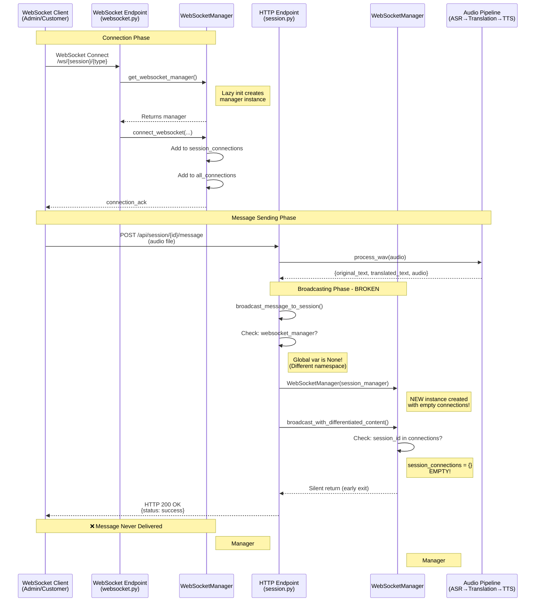
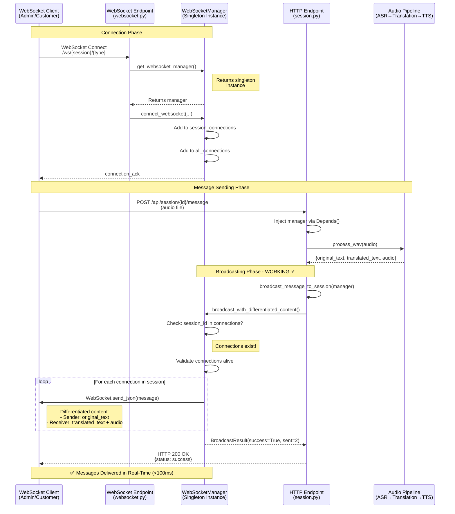
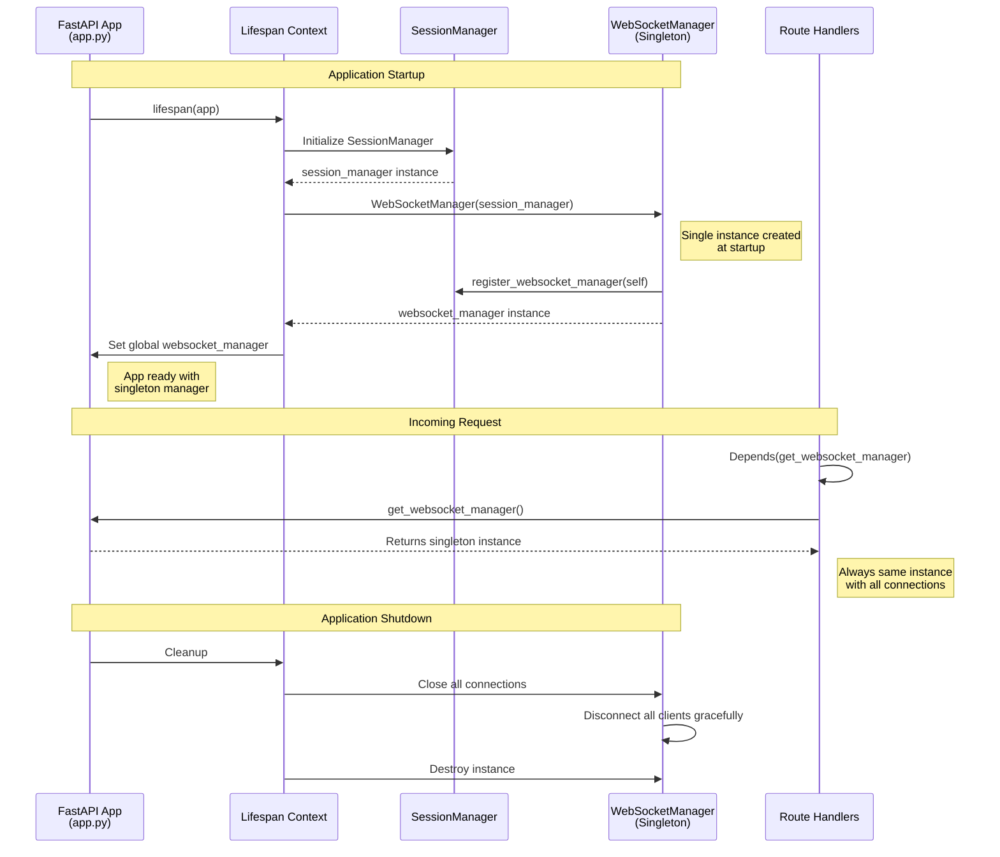
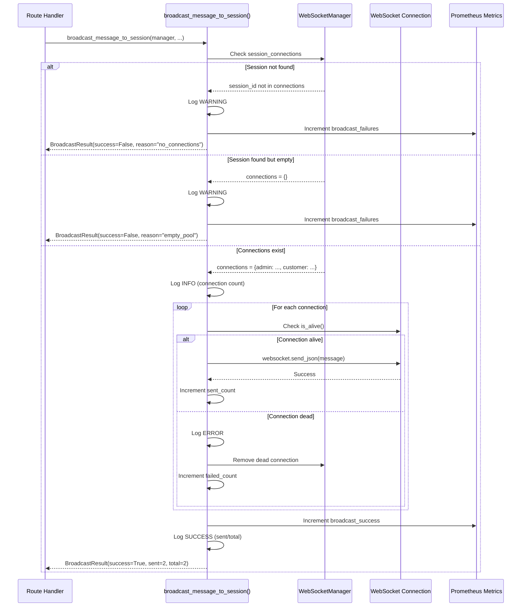
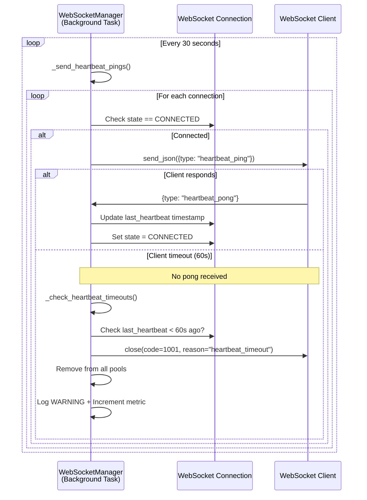

# WebSocket Message Flow - Sequence Diagrams

## 1. Current State (Broken) - Message Flow

## 2. Expected State (After Fix) - Message Flow

## 3. Dependency Injection Flow (Target Architecture)

## 4. Broadcasting Validation Flow (New)

## 5. Heartbeat Management Flow

## Key Differences: Current vs. Target

| Aspect | Current (Broken) | Target (Fixed) |
|--------|-----------------|----------------|
| **Manager Instances** | 2+ instances per request | 1 singleton instance |
| **Instance Creation** | Lazy init on first access | Created at app startup |
| **Dependency Injection** | Manual global variable | FastAPI `Depends()` |
| **Connection Pools** | Fragmented across instances | Shared in single instance |
| **Broadcasting** | Silent failure (empty pool) | Validated with error logging |
| **Return Type** | `None` (void) | `BroadcastResult` with status |
| **Error Visibility** | "Success" logs for failures | Explicit failure reporting |
| **Metrics** | No broadcast metrics | Success/failure counters |
| **Message Delivery** | 0% success rate | 100% success rate (goal) |

## Implementation Priority

1. **Critical**: Fix singleton pattern (prevent multiple instances)
2. **High**: Add broadcast validation and error reporting
3. **Medium**: Implement proper dependency injection
4. **Low**: Add metrics and monitoring

## Testing Verification Points

- [ ] Only one `WebSocketManager` instance exists at runtime
- [ ] All routes receive same instance via DI
- [ ] Broadcasting logs connection count before sending
- [ ] Failed broadcasts return `BroadcastResult(success=False)`
- [ ] E2E test shows 100% message delivery
- [ ] No "WebSocketManager ist None" in logs
- [ ] Metrics show broadcast success rate
