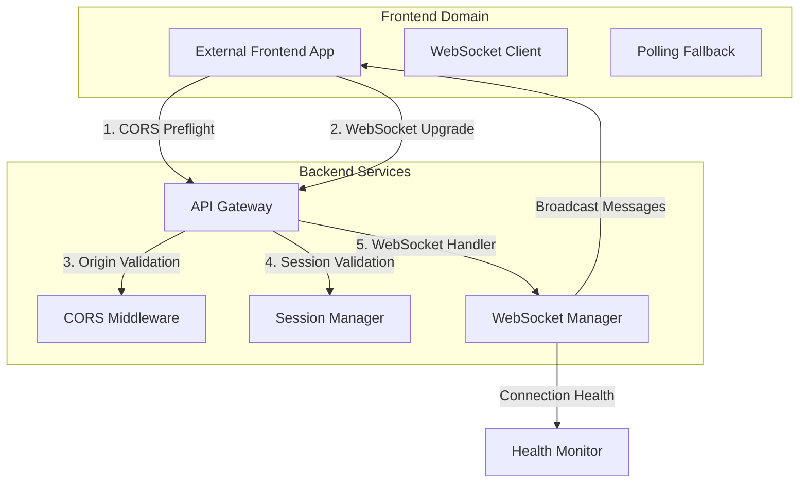

# Frontend WebSocket Integration: Technical Design

## Architecture Overview



## CORS WebSocket Integration Pattern

### Current Issue Analysis

Die aktuelle CORS-Konfiguration in `app.py` ist primär für REST-API-Requests optimiert:

```python
app.add_middleware(
    CORSMiddleware,
    allow_origin_regex=r"https://.*\.figma\.site|https://translate\.smart-village\.solutions",
    allow_credentials=True,
    allow_methods=["*"],
    allow_headers=["*"],
)
```

**Probleme:**
1. WebSocket-Upgrade erfordert spezielle Header-Behandlung
2. `allow_origin_regex` ist zu restriktiv für Development
3. WebSocket-spezifische CORS-Preflight nicht optimal gehandhabt

### Proposed CORS Enhancement

```python
# Enhanced CORS Configuration for WebSocket Support
def setup_cors_for_websockets(app: FastAPI):
    # Development vs Production CORS
    development_origins = os.getenv("DEVELOPMENT_CORS_ORIGINS", "").split(",")
    production_pattern = r"https://.*\.figma\.site|https://translate\.smart-village\.solutions"

    if os.getenv("ENVIRONMENT") == "development":
        allow_origins = development_origins + ["http://localhost:*", "https://localhost:*"]
        allow_origin_regex = None
    else:
        allow_origins = []
        allow_origin_regex = production_pattern

    app.add_middleware(
        CORSMiddleware,
        allow_origins=allow_origins,
        allow_origin_regex=allow_origin_regex,
        allow_credentials=True,
        allow_methods=["GET", "POST", "PUT", "DELETE", "OPTIONS", "HEAD"],
        allow_headers=[
            "Content-Type",
            "Authorization",
            "Accept",
            "Origin",
            "User-Agent",
            "Cache-Control",
            "Pragma",
            # WebSocket-specific headers
            "Upgrade",
            "Connection",
            "Sec-WebSocket-Key",
            "Sec-WebSocket-Version",
            "Sec-WebSocket-Protocol",
            "Sec-WebSocket-Extensions"
        ],
        expose_headers=[
            "Content-Length",
            "Content-Type",
            # WebSocket upgrade response headers
            "Upgrade",
            "Connection",
            "Sec-WebSocket-Accept"
        ]
    )
```

## WebSocket Connection Flow

### Enhanced Connection Establishment

```python
@router.websocket("/ws/{session_id}/{client_type}")
async def websocket_endpoint(
    websocket: WebSocket,
    session_id: str,
    client_type: str,
    origin: Optional[str] = Header(None),  # Explicit Origin handling
    manager: WebSocketManager = Depends(get_websocket_manager),
):
    """
    Enhanced WebSocket endpoint with explicit CORS validation
    """
    # 1. CORS Origin Validation
    if not await validate_websocket_origin(origin):
        await websocket.close(code=1008, reason="Origin not allowed")
        return

    # 2. Session Validation (existing)
    try:
        client_type_enum = ClientType(client_type.lower())
    except ValueError:
        await websocket.close(code=1003, reason="Invalid client type")
        return

    # 3. Session exists validation (existing)
    session = manager.session_manager.get_session(session_id)
    if not session:
        await websocket.close(code=1003, reason="Session not found")
        return

    # 4. Connection establishment with origin logging
    logger.info(f"WebSocket connection from origin: {origin}")
    connection_id = await manager.connect_websocket(
        websocket, session_id, client_type_enum,
        client_info={"origin": origin}
    )

    # ... rest of existing logic
```

### Origin Validation Function

```python
async def validate_websocket_origin(origin: Optional[str]) -> bool:
    """
    Validate WebSocket origin against allowed origins
    """
    if not origin:
        return False  # Reject connections without Origin header

    # Development environment - allow localhost
    if os.getenv("ENVIRONMENT") == "development":
        if origin.startswith(("http://localhost", "https://localhost")):
            return True

        # Allow configured development origins
        dev_origins = os.getenv("DEVELOPMENT_CORS_ORIGINS", "").split(",")
        if origin in dev_origins:
            return True

    # Production environment - strict validation
    production_pattern = r"https://.*\.figma\.site|https://translate\.smart-village\.solutions"
    return bool(re.match(production_pattern, origin))
```

## Client-Side Integration Pattern

### JavaScript WebSocket Client with CORS

```javascript
class SSFWebSocketClient {
    constructor(sessionId, clientType, options = {}) {
        this.sessionId = sessionId;
        this.clientType = clientType;
        this.options = {
            protocol: window.location.protocol === 'https:' ? 'wss:' : 'ws:',
            host: options.host || 'translate.smart-village.solutions',
            reconnectAttempts: options.reconnectAttempts || 5,
            reconnectInterval: options.reconnectInterval || 1000,
            fallbackToPolling: options.fallbackToPolling !== false,
            ...options
        };

        this.ws = null;
        this.reconnectCount = 0;
        this.isConnected = false;
        this.messageQueue = [];

        // Event handlers
        this.onOpen = options.onOpen || (() => {});
        this.onMessage = options.onMessage || (() => {});
        this.onError = options.onError || (() => {});
        this.onClose = options.onClose || (() => {});
    }

    async connect() {
        const wsUrl = `${this.options.protocol}//${this.options.host}/ws/${this.sessionId}/${this.clientType}`;

        try {
            this.ws = new WebSocket(wsUrl);

            this.ws.onopen = (event) => {
                console.log('WebSocket connected:', wsUrl);
                this.isConnected = true;
                this.reconnectCount = 0;

                // Send queued messages
                this.flushMessageQueue();

                this.onOpen(event);
            };

            this.ws.onmessage = (event) => {
                const data = JSON.parse(event.data);
                this.onMessage(data);
            };

            this.ws.onerror = (event) => {
                console.error('WebSocket error:', event);
                this.onError(event);

                // Attempt fallback to polling if enabled
                if (this.options.fallbackToPolling && this.reconnectCount >= this.options.reconnectAttempts) {
                    this.enablePollingFallback();
                }
            };

            this.ws.onclose = (event) => {
                console.log('WebSocket closed:', event.code, event.reason);
                this.isConnected = false;

                this.onClose(event);

                // Auto-reconnect logic
                if (event.code !== 1000 && this.reconnectCount < this.options.reconnectAttempts) {
                    this.scheduleReconnect();
                }
            };

        } catch (error) {
            console.error('WebSocket connection failed:', error);
            this.onError(error);

            if (this.options.fallbackToPolling) {
                this.enablePollingFallback();
            }
        }
    }

    sendMessage(message) {
        if (this.isConnected && this.ws.readyState === WebSocket.OPEN) {
            this.ws.send(JSON.stringify(message));
        } else {
            // Queue message for later delivery
            this.messageQueue.push(message);
        }
    }

    scheduleReconnect() {
        this.reconnectCount++;
        const delay = Math.min(
            this.options.reconnectInterval * Math.pow(2, this.reconnectCount - 1),
            30000  // Max 30 seconds
        );

        console.log(`Reconnecting in ${delay}ms (attempt ${this.reconnectCount}/${this.options.reconnectAttempts})`);

        setTimeout(() => {
            this.connect();
        }, delay);
    }

    async enablePollingFallback() {
        console.log('Enabling polling fallback...');

        try {
            // Enable polling on server
            const response = await fetch(`/api/websocket/sessions/${this.sessionId}/polling/enable`, {
                method: 'POST',
                headers: { 'Content-Type': 'application/json' },
                body: JSON.stringify({ client_type: this.clientType })
            });

            const { polling_id } = await response.json();
            this.startPolling(polling_id);

        } catch (error) {
            console.error('Failed to enable polling fallback:', error);
        }
    }

    startPolling(pollingId) {
        this.pollingInterval = setInterval(async () => {
            try {
                const response = await fetch(`/api/websocket/polling/${pollingId}/messages`);
                const messages = await response.json();

                messages.forEach(message => this.onMessage(message));

            } catch (error) {
                console.error('Polling error:', error);
            }
        }, 2000);  // Poll every 2 seconds
    }

    flushMessageQueue() {
        while (this.messageQueue.length > 0) {
            const message = this.messageQueue.shift();
            this.sendMessage(message);
        }
    }

    disconnect() {
        if (this.ws) {
            this.ws.close(1000, 'Client disconnect');
        }

        if (this.pollingInterval) {
            clearInterval(this.pollingInterval);
        }
    }
}

// Usage Example
const client = new SSFWebSocketClient('session-123', 'customer', {
    host: 'translate.smart-village.solutions',
    fallbackToPolling: true,
    onOpen: () => console.log('Connected to SSF'),
    onMessage: (data) => console.log('Received:', data),
    onError: (error) => console.error('Connection error:', error)
});

client.connect();
```

## Debugging and Monitoring

### WebSocket Connection Debug Endpoint

```python
@router.get("/api/websocket/debug/connection-test")
async def websocket_connection_test(
    origin: Optional[str] = Header(None),
    user_agent: Optional[str] = Header(None)
):
    """
    Debug endpoint to test WebSocket connection feasibility
    """
    return {
        "timestamp": datetime.now().isoformat(),
        "origin": origin,
        "user_agent": user_agent,
        "origin_allowed": await validate_websocket_origin(origin),
        "cors_headers": {
            "Access-Control-Allow-Origin": origin if await validate_websocket_origin(origin) else None,
            "Access-Control-Allow-Headers": "Upgrade, Connection, Sec-WebSocket-Key, Sec-WebSocket-Version",
            "Access-Control-Allow-Methods": "GET, OPTIONS"
        },
        "websocket_endpoint": f"/ws/{{session_id}}/{{client_type}}",
        "environment": os.getenv("ENVIRONMENT", "production"),
        "suggestions": [
            "Check if origin is in allowed list",
            "Verify WebSocket upgrade headers are included in request",
            "Ensure HTTPS is used in production (wss://)",
            "Check browser console for CORS errors"
        ]
    }
```

### Enhanced WebSocket Metrics

```python
# Additional metrics for WebSocket CORS monitoring
websocket_cors_failures = Counter(
    "websocket_cors_failures_total",
    "Total WebSocket CORS failures",
    ["origin", "reason"],
    registry=registry
)

websocket_connection_duration = Histogram(
    "websocket_connection_duration_seconds",
    "WebSocket connection establishment duration",
    ["origin_type"],  # same_origin, cross_origin
    registry=registry
)
```

## Testing Strategy

### Automated Integration Tests

```python
class TestWebSocketCORS:
    @pytest.mark.asyncio
    async def test_cross_origin_websocket_connection(self):
        """Test WebSocket connection from different origins"""

        origins_to_test = [
            "https://example.figma.site",
            "https://translate.smart-village.solutions",
            "http://localhost:3000",  # Development
            "https://malicious-site.com"  # Should fail
        ]

        for origin in origins_to_test:
            with TestClient(app) as client:
                with client.websocket_connect(
                    "/ws/test-session/customer",
                    headers={"Origin": origin}
                ) as websocket:
                    if origin == "https://malicious-site.com":
                        # Should be rejected
                        assert websocket.close_code == 1008
                    else:
                        # Should connect successfully
                        data = websocket.receive_json()
                        assert data["type"] == "connection_ack"
```

## Security Considerations

### Origin Validation Security

1. **Strict Production Origins**: Nur explizit erlaubte Origins in Production
2. **Development Flexibility**: Localhost und konfigurierbare Origins für Development
3. **Header Validation**: Alle WebSocket-spezifischen Headers validieren
4. **Connection Logging**: Alle WebSocket-Verbindungen mit Origin loggen

### Attack Prevention

1. **Origin Spoofing**: Server-seitige Origin-Validierung nicht umgehbar
2. **CSRF Protection**: WebSocket-Verbindungen erfordern gültige Session-ID
3. **DoS Prevention**: Rate-Limiting für WebSocket-Verbindungsversuche
4. **Resource Cleanup**: Automatic disconnect bei invaliden Origins
